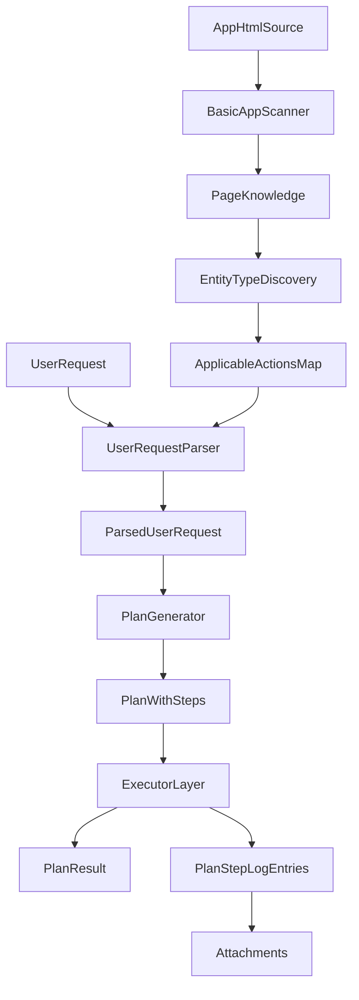
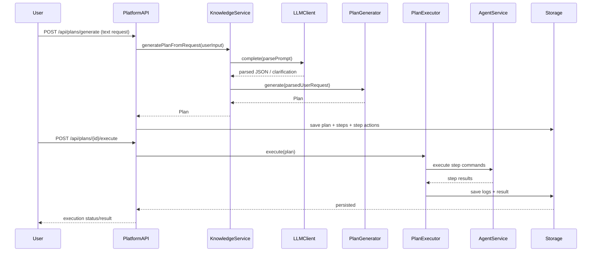

# Подробная логика работы Automation Platform

## 1. Цель документа

Этот документ подробно описывает рабочую логику проекта в двух основных потоках:

1. Первичная обработка среды (подготовка базы знаний и применимости действий).
2. Обработка пользовательского запроса (от текста пользователя до `plan_result` и логов выполнения).

Документ синхронизирован с:
- `docs/01-ЧТО-ДОЛЖНО-БЫТЬ.md`
- `docs/bots/BOT-4-PLATFORM-KNOWLEDGE.md`
- `docs/03-ПЛАН-РАБОТ.md`

## 2. Роль модулей в этой логике

- `platform-knowledge` — понимает UI приложения, парсит запросы через LLM, строит структуру будущего плана.
- `platform-core` — содержит доменные контракты (`Plan`, `PlanStep`, `PlanStepAction`, `PlanResult`) и проверку применимости действий через `Resolver`.
- `platform-api` — хранит справочники и рабочие данные (plan/step/result/log), отдает REST.
- `platform-agent` — преобразует шаги плана в браузерные команды.
- `platform-executor` — выполняет план пошагово и агрегирует итог.

## 3. Словарь ключевых терминов

- `action_type` — категория действия (`navigation`, `interaction`, `data_input`, `validation`, `artifact`).
- `action` — конкретное действие (`open_page`, `click`, `input_text`, `select_option`, `wait_element`, `read_text`, `take_screenshot`).
- `entity_type` — тип UI-сущности (`page`, `form`, `input`, `button`, `link`, `table`).
- `action_applicable_entity_type` — таблица применимости `action` к `entity_type`.
- `plan` — задача пользователя высокого уровня, содержит ЖЦ плана и набор шагов.
- `plan_step` — подзадача внутри плана над конкретной сущностью.
- `plan_step_action` — атомарное действие внутри шага, может нести `meta_value`.
- `plan_result` — итог выполнения плана (успех/неуспех + время).
- `plan_step_log_entry` — лог выполнения шага (текст, ошибка, ссылка на вложение).
- `attachment` — артефакт (например, скриншот ошибки).

## 4. Поток 1: первичная обработка среды

Этот поток выполняется заранее, до первого пользовательского запроса.

### 4.1. Определение `action_type`

На уровне справочников создаются типы действий:
- `navigation`
- `interaction`
- `data_input`
- `validation`
- `artifact`

Назначение:
- классифицировать действия;
- упростить поддержку и расширение каталога действий;
- дать LLM и планировщику стабильный словарь возможностей.

### 4.2. Генерация каталога `action`

Действия формируются из двух источников:

1. Базовый каталог платформы (изначально известные действия).
2. База знаний о конкретном приложении (результат сканирования UI и накопленных знаний).

Пример базового набора:
- `open_page`
- `click`
- `input_text`
- `select_option`
- `wait_element`
- `read_text`
- `take_screenshot`

Примечание:
в будущем набор действий может расширяться под домен клиента, но входить в систему только после проверки совместимости с существующими `entity_type`.

### 4.3. Построение применимости `action -> entity_type`

Ключевая таблица: `action_applicable_entity_type`.

Пример применимости:
- `open_page -> page`
- `click -> button, link`
- `input_text -> input`
- `select_option -> input`
- `wait_element -> page, form`
- `read_text -> table, page`
- `take_screenshot -> page`

Зачем это нужно:
- не строить заведомо невалидные планы;
- ограничить пространство решений для планировщика;
- ускорить поиск цепочки действий для конкретной задачи.

### 4.4. Сканирование UI и обогащение базы знаний

`platform-knowledge` сканирует HTML страниц через `AppScanner`:
- находит элементы (`input`, `button`, `link`, `form`, `table`, `select`, `textarea`);
- извлекает `label`, атрибуты и CSS-селектор;
- сохраняет структуру в `AppKnowledge/PageKnowledge/UIElement`.

Далее `EntityTypeDiscovery` сопоставляет типы найденных элементов и доступные действия через `Resolver.findActionsApplicableToEntityType(...)`.

Это связывает UI целевого приложения с бизнес-словарем действий.

## 5. Поток 2: обработка пользовательского запроса

### 5.1. Вход

Пользователь отправляет естественный запрос, например:
- "Открой страницу поиска, введи `ноутбук` и нажми найти".

### 5.2. LLM-парсинг запроса

`UserRequestParser`:
1. Собирает доступные `entity_type` и `action` через `Resolver`.
2. Подставляет их в prompt `parse-user-request.txt`.
3. Передает prompt в `LLMClient`.
4. Преобразует JSON-ответ в `ParsedUserRequest`.

Ожидаемый результат:
- `entityTypeId`
- `actionIds`
- `parameters` (например, `meta_value`, `target`)
- флаг `clarificationNeeded`
- `clarificationQuestion`

#### Ветка уточнения

Если JSON невалидный или запрос неоднозначный:
- `clarificationNeeded = true`
- формируется уточняющий вопрос;
- план не строится до ответа пользователя.

### 5.3. Поиск пути и построение `plan`

`PlanGenerator` берет `ParsedUserRequest` и:
1. Проверяет каждый `actionId` на применимость к `entityTypeId` через `resolver.isActionApplicable(...)`.
2. Формирует последовательность `plan_step`.
3. Для каждого шага добавляет `plan_step_action` c `meta_value` (если есть).
4. Создает `plan` с `workflow = wf-plan` и стартовым шагом ЖЦ `new`.

Если после фильтрации нет ни одного валидного действия:
- выбрасывается ошибка валидации (невозможно построить исполнимый план).

### 5.4. Структура `plan`

`plan` хранит:
- `workflow_step_internalname` (текущий шаг ЖЦ плана),
- `stopped_at_plan_step` (на каком шаге остановилось выполнение),
- `target` (цель),
- `explanation` (объяснение построенного пути),
- набор `plan_step`.

### 5.5. Структура `plan_step`

Каждый шаг содержит:
- собственный ЖЦ (`new -> in_progress -> completed/failed/...`),
- `entitytype`,
- `entity_id` (целевой объект),
- `sortorder`,
- массив `plan_step_action`.

### 5.6. Структура `plan_step_action`

Каждое действие шага содержит:
- `action` (ID действия),
- `meta_value` (параметр действия, например вводимая строка или опция выбора).

Пример:
- действие `input_text` с `meta_value = "ноутбук"`.

### 5.7. Выполнение и фиксация результата

После построения план передается в executor/agent слой:
1. Шаги выполняются по порядку.
2. По каждому шагу пишутся логи.
3. В конце создается `plan_result`.

При ошибке или прерывании:
- пишется `plan_step_log_entry` с текстом ошибки и контекстом;
- прикладывается скриншот (`attachment`) для диагностики.

## 6. Подробные сценарии

### 6.1. Сценарий A: успешное выполнение

Запрос:
- "Открой поиск, введи `java selenium`, нажми кнопку `Найти`."

Ожидаемая цепочка:
1. `open_page` для `page`.
2. `input_text` для `input` (`meta_value = "java selenium"`).
3. `click` для `button`.
4. `wait_element` для `page/form`.

Итог:
- `plan_result.success = true`
- последний `plan_step` в `completed`
- ошибок и error-attachment нет.

### 6.2. Сценарий B: нужен уточняющий вопрос

Запрос:
- "Сделай отчет."

Проблема:
- не указан объект (`table/page/form`) и целевое действие (`read_text/export/...`).

Поведение:
1. LLM возвращает `clarificationNeeded = true`.
2. Система задает вопрос, например:
   - "Уточните, пожалуйста: какой отчет нужно получить и где именно (раздел/таблица)?"
3. До ответа пользователя `plan` не создается.

### 6.3. Сценарий C: ошибка на этапе выполнения

Запрос:
- "Найди клиента `Ivanov` и открой карточку."

План построен корректно, но во время выполнения:
- кнопка открытия недоступна (элемент не найден или скрыт).

Поведение:
1. Шаг переходит в `failed`.
2. Записывается `plan_step_log_entry` с ошибкой.
3. Создается скриншот текущего состояния страницы.
4. Создается/обновляется `plan_result` с `success = false`.

## 7. Контракты данных (примеры JSON)

### 7.1. Пример ParsedUserRequest

```json
{
  "rawInput": "Открой поиск и введи ноутбук",
  "entityTypeId": "ent-input",
  "actionIds": ["act-open-page", "act-input-text", "act-click"],
  "parameters": {
    "target": "search-page",
    "meta_value": "ноутбук"
  },
  "clarificationNeeded": false,
  "clarificationQuestion": null
}
```

### 7.2. Пример Plan

```json
{
  "id": "plan-uuid",
  "workflowId": "wf-plan",
  "workflowStepInternalName": "new",
  "stoppedAtPlanStepId": "step-1",
  "target": "search-page",
  "explanation": "Выполнить поиск по запросу пользователя",
  "steps": [
    {
      "id": "step-1",
      "planId": "plan-uuid",
      "workflowId": "wf-plan-step",
      "workflowStepInternalName": "new",
      "entityTypeId": "ent-page",
      "entityId": "search-page",
      "sortOrder": 1,
      "displayName": "Открыть страницу поиска",
      "actions": [
        { "actionId": "act-open-page", "metaValue": null }
      ]
    }
  ]
}
```

### 7.3. Пример PlanStepLogEntry с ошибкой

```json
{
  "id": "log-uuid",
  "planStepId": "step-3",
  "message": "Не удалось выполнить click: элемент не найден",
  "error": "Timeout waiting for selector button#search",
  "attachmentId": "att-uuid",
  "createdTime": "2026-03-16T10:15:00Z"
}
```

### 7.4. Пример PlanResult

```json
{
  "id": "result-uuid",
  "planId": "plan-uuid",
  "success": false,
  "startedTime": "2026-03-16T10:14:00Z",
  "finishedTime": "2026-03-16T10:15:05Z"
}
```

## 8. Диаграммы

### 8.1. Основной dataflow



### 8.2. Sequence: от запроса до результата



## 9. Ошибки и правила обработки

### 9.1. Ошибки понимания запроса

- Причина: LLM дал невалидный JSON или неполный ответ.
- Реакция: режим уточнения, без генерации плана.

### 9.2. Ошибки валидации плана

- Причина: действия не применимы к выбранному `entity_type`.
- Реакция: отказ от генерации с понятным сообщением.

### 9.3. Ошибки выполнения шага

- Причина: проблемы UI, таймаут, недоступный элемент.
- Реакция: лог ошибки + скриншот + финальный `plan_result.success = false`.

## 10. Границы текущего этапа и дальнейшее развитие

### Уже в фокусе BOT-4

- Доменная модель знаний (`AppKnowledge`, `PageKnowledge`, `UIElement`, `ParsedUserRequest`).
- In-memory репозиторий знаний.
- LLM abstraction и шаблоны prompt.
- Парсер запроса пользователя.
- Генератор плана.
- Сканер страниц и discovery применимых действий.
- Фасад `KnowledgeService`.

### Целевое развитие (следующие фазы)

- Сегментация знаний по `entity_type` и доменам приложений.
- Более строгая машина переходов ЖЦ через `workflow_transition`.
- Полная интеграция knowledge-слоя в REST (`/api/knowledge/scan`, `/api/plans/generate`).
- Расширенные стратегии fallback и интерактивных уточнений.
- E2E-пайплайн с асинхронным исполнением и richer telemetry.

## 11. Краткий итог

Основная идея платформы:
- заранее понять, какие действия вообще возможны и где они применимы;
- на запрос пользователя строить не произвольный, а валидируемый путь;
- каждую стадию фиксировать как доменные сущности (`plan`, `plan_step`, `plan_step_action`, `plan_result`, `plan_step_log_entry`);
- в случае сбоев оставлять полную трассировку и артефакты для восстановления и анализа.
