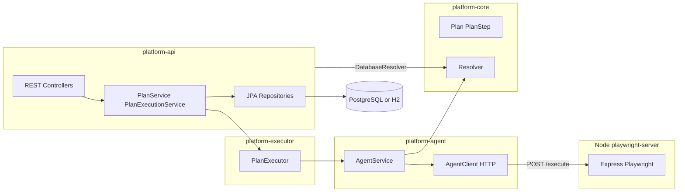
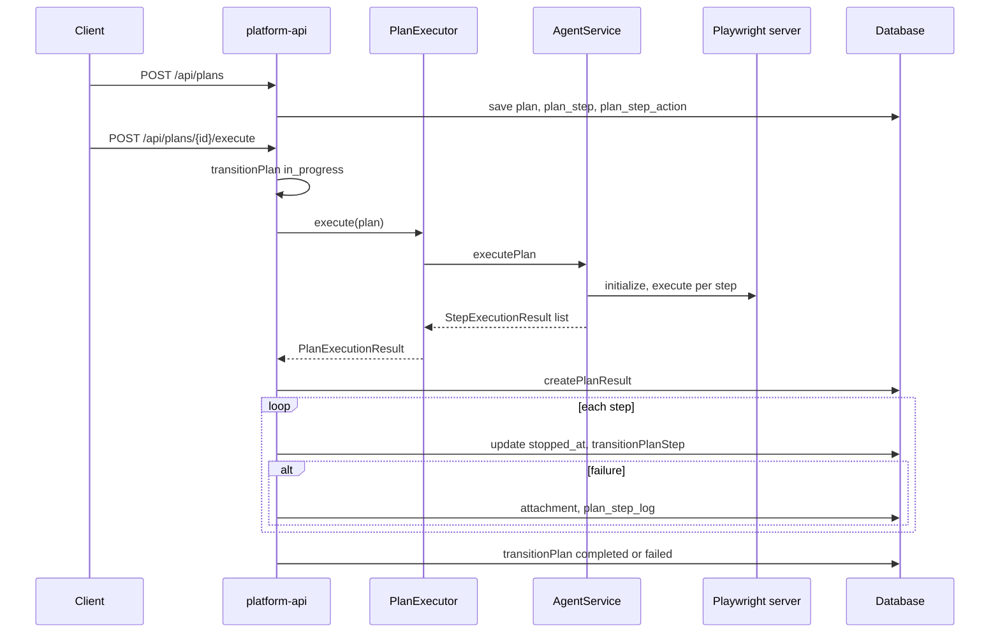

# Архитектура automation-platform

Документ описывает фактическое состояние репозитория: модули, база данных (Flyway: `V1` — DDL, `V2`–`V3` — данные), жизненные циклы, цепочку выполнения плана, HTTP API, зависимости и расхождения с целевой схемой (LLM, RAD, база знаний). Дополняет доменное описание в [CORE-DETAILED-LOGIC-WITH-EXAMPLES.md](./CORE-DETAILED-LOGIC-WITH-EXAMPLES.md).

Если БД уже проходила старую цепочку `V1`…`V11`, после схлопывания миграций нужно либо пересоздать схему, либо выровнять историю Flyway вручную (`repair` / baseline / очистка `flyway_schema_history`) под новый набор файлов.

---

## 1. Обзор модулей и зависимостей

Корневой aggregator: `pom.xml`. Java 21, Spring Boot **3.2.1** (BOM из родительского POM).

| Модуль | Роль | Зависимости (прямые) |
|--------|------|----------------------|
| **platform-core** | Доменные records (`Plan`, `PlanStep`, `PlanStepAction`), справочные модели, контракт `Resolver`, `Planner` / `ExecutionEngine` — без Spring | slf4j-api, logback-classic, junit (test) |
| **platform-agent** | HTTP-клиент к Node Playwright-серверу; `AgentService` маппит `PlanStep` → `AgentCommand` | platform-core, jackson-databind, slf4j, logback |
| **platform-executor** | `PlanExecutor`: вызов агента по шагам, сбор `PlanExecutionResult` / `ExecutionLogEntry` | platform-core, platform-agent |
| **platform-knowledge** | Сканирование HTML (Jsoup), in-memory хранилище знаний о приложении | platform-core, jackson-databind, jsoup |
| **platform-api** | Spring Boot: REST, JPA, Flyway, оркестрация выполнения плана | web, validation, data-jpa, h2, postgresql, flyway, springdoc, platform-core, platform-agent, platform-executor |

**Важно:** `platform-knowledge` **не объявлен** в `platform-api/pom.xml` — модуль собирается отдельно, интеграции с API/PostgreSQL нет.



---

## 2. База данных: схемы и таблицы

Миграции: `platform-api/src/main/resources/db/migration/`.

### 2.1 Схема `system`

| Таблица | Назначение | Ключевые поля и связи |
|---------|------------|------------------------|
| **entity_type** | Типы объектов UI/домена | PK `id`, `displayname`, `km_article`, `ui_description`, `entityfieldlist`, `buttons`, timestamps |
| **workflow_step** | Справочник шагов ЖЦ | PK `id`, `internalname`, `displayname`, `sortorder` |
| **workflow** | Определение ЖЦ | PK `id`, `displayname`, FK `firststep` → `workflow_step` |
| **action_type** | Категории действий | PK `id`, `internalname`, `displayname` |
| **action** | Действия платформы | PK `id`, FK `action_type`, `internalname`, `displayname`, `meta_value`, `description`, timestamps |
| **action_applicable_entity_type** | Применимость действия к типу сущности | PK (`action`, `entity_type`), FK → `action`, `entity_type` |
| **workflow_transition** | Допустимые переходы ЖЦ | PK `id`, FK `workflow` → `workflow`, `from_step`, `to_step` (строковые internal-имена) |

Сиды справочников и примеров применимости: `V2__Insert_initial_data.sql` (в т.ч. `wf-plan`, `wf-plan-step`, `act-*`, `ent-*`).

### 2.2 Схема `zbrtstk`

| Таблица | Назначение | Ключевые поля и связи |
|---------|------------|------------------------|
| **attachment** | Метаданные вложения (например путь к скриншоту в `displayname`) | PK `id` |
| **plan** | Экземпляр задачи пользователя | FK `workflow` → `system.workflow`, `workflow_step_internalname` (статус ЖЦ плана), `stopped_at_plan_step`, `target`, `explanation`, timestamps |
| **plan_step** | Шаг плана | FK `plan`, `workflow`, `entitytype` → `entity_type`, `workflow_step_internalname` (**только ЖЦ шага**: `new`, `in_progress`, `completed`, …), `entity_id` (до **510** символов), `sortorder`, `displayname`, timestamps |
| **plan_step_action** | Действия внутри шага | PK (`plan_step`, `action`), `meta_value` TEXT |
| **plan_result** | Итог выполнения | FK `plan`, `success`, `started_time`, `finished_time` |
| **plan_step_log** | Лог при ошибке | FK `plan`, `plan_step`, `plan_result`, `action`, `attachment`; `message`, `error` (до **2000** символов), `executed_time`, `execution_time_ms` |
| **scenario** | Шаблон плана | FK `workflow`, поля имени, цели, пояснения, ЖЦ |
| **scenario_step** | Шаг шаблона | FK `scenario`, `workflow`, `entitytype`, структура аналогична `plan_step` |
| **scenario_step_action** | Действия шага шаблона | PK (`scenario_step`, `action`), `meta_value` |

### 2.3 Тип UI-операции: `system.action.internalname`

Исполнитель ([`AgentService`](platform-agent/src/main/java/com/zaborstik/platform/agent/service/AgentService.java)) определяет команду Playwright по **`system.action.internalname`** первой записи `plan_step_action` с валидным `action_id` (через `Resolver.findAction`). Значения совпадают с ветками маппера: `open_page`, `click`, `hover`, `type`, `wait`, `explain`, `select_option`, `read_text`, `take_screenshot`. Устаревший fallback по полю `workflowStepInternalName` шага срабатывает только если строка **не** входит в справочник шагов ЖЦ: `Resolver.isWorkflowStepInternalName` (в API — по кэшу из `system.workflow_step`, без хардкода в агенте).

Поле **`plan_step.workflow_step_internalname`** хранит **только жизненный цикл шага** (`new` → `in_progress` → `completed` / `failed` / …). При создании плана через API ([`PlanService.createPlan`](platform-api/src/main/java/com/zaborstik/platform/api/service/PlanService.java)) начальный шаг ЖЦ **плана** и **каждого шага** берётся из `system.workflow.firststep` для соответствующего `workflow_id` (не из тела запроса); поля `workflowStepInternalName` в DTO при создании игнорируются (см. [`CreatePlanRequest`](platform-api/src/main/java/com/zaborstik/platform/api/dto/CreatePlanRequest.java)).

Связь `plan_step_action` → `action` нужна и для логирования: [`plan_step_log.action`](platform-api/src/main/resources/db/migration/V1__Create_schemas_and_tables.sql).

[`V2__Insert_initial_data.sql`](platform-api/src/main/resources/db/migration/V2__Insert_initial_data.sql) — начальное наполнение справочников (`workflow_step`, `workflow`, `action*`, `entity_type`, `workflow_transition` и т.д.) без post-migrate правок legacy-данных.

---

## 3. Переходы жизненного цикла (`workflow_transition`)

Строки переходов вставляются в [`V2__Insert_initial_data.sql`](platform-api/src/main/resources/db/migration/V2__Insert_initial_data.sql) (только состояния ЖЦ, не типы UI-действий).

### ЖЦ плана (`workflow_id = wf-plan`)

| from_step | to_step |
|-----------|---------|
| new | in_progress |
| in_progress | paused |
| in_progress | completed |
| in_progress | failed |
| paused | in_progress |
| paused | cancelled |
| new | cancelled |

### ЖЦ шага плана (`workflow_id = wf-plan-step`)

| from_step | to_step |
|-----------|---------|
| new | in_progress |
| in_progress | completed |
| in_progress | failed |
| in_progress | paused |
| paused | in_progress |
| paused | cancelled |
| new | cancelled |

Переходы проверяются в `PlanService.transitionPlan` и `PlanService.transitionPlanStep` через `WorkflowTransitionRepository.findByWorkflow_IdAndFromStepAndToStep`.

### Семантика поля `plan_step.workflow_step_internalname`

Только **состояние ЖЦ шага** (`new`, `in_progress`, `completed`, `failed`, `paused`, `cancelled`). Тип UI-операции не дублируется в этом поле и берётся из `action.internalname` по связям `plan_step_action` / `scenario_step_action`.

---

## 4. Потоки данных: первичная настройка и рантайм

### 4.1 Первичная обработка (концепция)

1. Определение `action_type`.
2. Создание `action`.
3. Заполнение `action_applicable_entity_type` для сегментации по `entity_type`.
4. (Опционально) workflow, UI-привязки.

**В репозитории:** пункты 1–3 выполняются через Flyway + администрирование (REST по `entity-types` и `actions`) или прямые миграции/скрипты. Автоматической генерации из «базы знаний» или RAD в API нет.

### 4.2 Рантайм

- Справочники читает `DatabaseResolver` (реализация `Resolver`).
- `DatabaseResolver.findUIBinding` **всегда возвращает `Optional.empty()`** — таблица UI-binding в V1 закомментирована; резолвинг `action(uuid)` в `AgentService.resolveSelector` не получит селектор из БД.
- LLM/RAD как сервисы **отсутствуют**; ожидается внешний клиент, формирующий тело `POST /api/plans`.



---

## 5. HTTP API (platform-api)

Базовый префикс контекста: `/` (порт по умолчанию 8080). OpenAPI: `springdoc` — `/api-docs`, UI `/swagger-ui.html`.

### 5.1 Планы — `/api/plans`

| Метод | Путь | Описание |
|-------|------|----------|
| GET | `/api/plans` | Список с пагинацией; опционально `status` фильтрует по `workflow_step_internalname` плана |
| POST | `/api/plans` | Создание плана (`CreatePlanRequest`) |
| GET | `/api/plans/{id}` | Получение плана |
| PATCH | `/api/plans/{id}/transition` | Переход ЖЦ плана (`TransitionPlanRequest.targetStep`) |
| POST | `/api/plans/{planId}/execute` | Синхронное выполнение через Playwright |
| POST | `/api/plans/{planId}/result` | Создание `plan_result` (может дублироваться с логикой execute — см. код) |
| POST | `/api/plans/{planId}/step-log` | Ручное создание записи лога шага |

### 5.2 Действия — `/api/actions`

| Метод | Путь | Описание |
|-------|------|----------|
| GET | `/api/actions` | Список; query `entityTypeId` — действия, применимые к типу |
| GET | `/api/actions/{id}` | Действие по id |
| POST | `/api/actions` | Создание |
| PUT | `/api/actions/{id}` | Обновление |
| DELETE | `/api/actions/{id}` | Удаление |

### 5.3 Типы сущностей — `/api/entity-types`

| Метод | Путь | Описание |
|-------|------|----------|
| GET | `/api/entity-types` | Список |
| GET | `/api/entity-types/{id}` | По id |
| POST | `/api/entity-types` | Создание |
| PUT | `/api/entity-types/{id}` | Обновление |
| DELETE | `/api/entity-types/{id}` | Удаление |

### 5.4 Workflow — `/api/workflows`, `/api/workflow-steps`

Только чтение: список и получение по id для `workflow` и `workflow_step`.

### 5.5 Сценарии (шаблоны в БД)

Таблицы `zbrtstk.scenario*` заполняются в `V4`, `V5`. **Отдельного REST-контроллера для сценариев в текущем дереве исходников нет** (только планы, действия, типы сущностей, workflow). Клиент может копировать данные из БД/SQL в `CreatePlanRequest`.

---

## 6. Сервисный слой (кратко)

| Класс | Ответственность |
|-------|-----------------|
| **PlanService** | Создание плана из DTO; маппинг через `PlanMapper`; переходы ЖЦ плана/шага; `createPlanResult`, `createPlanStepLog`, `createAttachment`; список планов с фильтром по статусу |
| **PlanExecutionService** | `executePlan`: перевод плана в `in_progress`, вызов `PlanExecutor`, запись результата и логов по шагам, скриншот → `attachment`, финальный переход плана. Зависимость `AgentService` в конструкторе **не используется** в теле класса (выполнение идёт через `PlanExecutor` → внутренний `AgentService`) |
| **ActionService** | CRUD действий; выборка по `entityTypeId` через `action_applicable_entity_type` |
| **EntityTypeService** | CRUD типов сущностей |
| **DatabaseResolver** | Реализация `Resolver` из JPA-репозиториев; UI binding не подключён |

Конфигурация бинов: `AgentExecutionConfiguration` — `AgentClient`, `AgentService`, `PlanExecutor`. Свойства: `platform.agent.server-url`, `platform.agent.base-url`, `platform.agent.headless` (`application.properties`).

---

## 7. Исполнение: platform-executor и platform-agent

- **PlanExecutor** вызывает `AgentService.executePlan`, сопоставляет каждый `PlanStep` с `StepExecutionResult`; при меньшем числе ответов добавляет синтетические ошибки.
- **AgentService** для шагов `click` / `hover` / `type` использует ветку с `RESOLVE_COORDS` и координатами; иначе строит `AgentCommand` по типу операции из `action.internalname` (fallback по `workflow_step_internalName` только если это не имя из `workflow_step`). Первый элемент `plan_step_action` задаёт `meta_value` (URL, текст, таймаут и т.д.).
- **AgentClient** — `java.net.http.HttpClient`, JSON через Jackson; сервер: `platform-agent/src/main/resources/package.json` (Express + Playwright).

Node-сервер ожидается по `PLATFORM_AGENT_SERVER_URL` (по умолчанию `http://localhost:3000`).

---

## 8. Пользовательские сценарии и примеры JSON

### 8.1 Создание и выполнение плана

При создании `PlanService` выставляет `stoppedAtPlanStepId` в id **первого шага**, если список шагов не пуст (см. `PlanService.createPlan` и доменную модель `Plan`).

Пример минимального тела `POST /api/plans` (идентификаторы workflow и действий должны существовать в БД). Поля `workflowStepInternalName` у плана и у шагов в запросе **игнорируются**: начальный ЖЦ берётся из `system.workflow.firststep` для соответствующего `workflowId`. Тип операции для Playwright — из `actionId` → `system.action.internalname` (здесь `act-open-page` → `open_page`).

```json
{
  "workflowId": "wf-plan",
  "workflowStepInternalName": "new",
  "target": "Открыть главную",
  "explanation": "Демо-план",
  "steps": [
    {
      "workflowId": "wf-plan-step",
      "workflowStepInternalName": "new",
      "entityTypeId": "ent-page",
      "entityId": "https://example.com",
      "sortOrder": 0,
      "displayName": "Открыть example.com",
      "actions": [
        {
          "actionId": "act-open-page",
          "metaValue": "https://example.com"
        }
      ]
    }
  ]
}
```

Далее: `POST /api/plans/{id}/execute` при запущенном Playwright-сервере.

### 8.2 Подбор действий под тип сущности (опора для внешнего планировщика)

`GET /api/actions?entityTypeId=ent-button` возвращает действия, связанные через `action_applicable_entity_type`.

### 8.3 Шаблон из БД (сценарий DuckDuckGo)

Сид [`V3__Insert_scenarios.sql`](platform-api/src/main/resources/db/migration/V3__Insert_scenarios.sql) задаёт шаги с селекторами в `entity_id` и связками `scenario_step_action`. Для выполнения тот же граф нужно преобразовать в `CreatePlanRequest` (вручную или будущим API сценариев).

### 8.4 Ядро `ExecutionEngine` / `Planner`

В `platform-core` одношаговый план из `ExecutionRequest` описан в [CORE-DETAILED-LOGIC-WITH-EXAMPLES.md](./CORE-DETAILED-LOGIC-WITH-EXAMPLES.md). Основной путь в API — **многошаговый** план через REST, без обязательного вызова `Planner` из контроллера.

---

## 9. Зависимости: Maven и Node

### 9.1 Корень и platform-api

- **spring-boot-starter-web** — REST.
- **spring-boot-starter-validation** — Bean Validation на DTO.
- **spring-boot-starter-data-jpa** — Hibernate, репозитории.
- **h2** (runtime, dev), **postgresql** (runtime, prod) — СУБД.
- **flyway-core** — миграции.
- **springdoc-openapi-starter-webmvc-ui** 2.3.0 — OpenAPI/Swagger UI.

Транзитивно: Jackson, Tomcat, Hibernate и др. (см. `mvn dependency:tree`).

### 9.2 platform-agent / platform-executor

- **jackson-databind** — сериализация команд агента.
- **slf4j + logback** — логирование.

### 9.3 platform-knowledge

- **jackson-databind** 2.16.1 (явная версия в модуле).
- **jsoup** 1.17.2 — разбор HTML.

### 9.4 Node (Playwright-сервер)

Файл `platform-agent/src/main/resources/package.json`: **express** ^4.18.2, **playwright** ^1.40.0, Node >= 18.

---

## 10. Безопасность, стабильность и отчёты сканирования

### 10.1 Рекомендации по эксплуатации

- Ограничить или отключить Swagger UI в production (отдельный профиль Spring).
- Не публиковать Playwright-сервер в открытую сеть; изолировать хост с браузером.
- Хранить креды БД в переменных окружения / секрет-хранилище, не в репозитории.
- Периодически обновлять Spring Boot и зависимости; следить за [Spring Security advisories](https://spring.io/security).

### 10.2 Инструменты в репозитории

В корневом `pom.xml` в `pluginManagement` настроен **OWASP dependency-check-maven** 10.0.4 (`failBuildOnCVSS` 7 для обычных сборок). Запуск вручную:

```bash
mvn -f pom.xml org.owasp:dependency-check-maven:aggregate -DfailBuildOnCVSS=11
```

Отчёты по умолчанию в `target/` модулей (HTML/JSON при соответствующей конфигурации).

Для Node:

```bash
cd platform-agent/src/main/resources && npm audit
```

### 10.3 Результаты сканирования на дату генерации документа

**npm audit** (каталог `platform-agent/src/main/resources`, после `npm install`): на **2026-03-21** отчёт `npm audit` показал **0** уязвимостей (info/low/moderate/high/critical), **71** production-зависимость в дереве (включая транзитивные). Рекомендуется повторять перед релизом: `cd platform-agent/src/main/resources && npm audit`.

**OWASP Dependency-Check** (Maven): в среде, где собирался этот документ, исполняемый файл `mvn` был недоступен, поэтому агрегированный отчёт **не сгенерирован автоматически**. Локально или в CI выполните из корня репозитория:

```bash
mvn org.owasp:dependency-check-maven:aggregate -DfailBuildOnCVSS=11 -DskipTests
```

Просмотрите HTML/JSON в `target/` соответствующих модулей (конкретные пути зависят от версии плагина и настроек в корневом `pom.xml`). При `failBuildOnCVSS=7` (как в `pluginManagement`) сборка может падать при критичных CVE — это ожидаемая политика качества.

**Обновляйте подраздел 10.3 и приложения A–B при повторных проверках.**

---

## 11. Чеклист: задумано vs реализовано

1. **LLM / RAD** — нет встроенных сервисов; только внешняя интеграция через REST.
2. **База знаний** — модуль `platform-knowledge` не подключён к API и не пишет в PostgreSQL.
3. **UIBinding** — резолвер не отдаёт привязки из БД; селекторы передаются в `plan_step.entity_id`.
4. **Сценарии** — таблицы и сиды есть; REST для сценариев в текущем коде отсутствует.
5. **Поле `workflow_step_internalname` на шаге** — после правок сидов/API используется только для ЖЦ; тип операции задаётся через `action.internalname` и `plan_step_action`.

---

## 12. Связанная документация

- [CORE-DETAILED-LOGIC-WITH-EXAMPLES.md](./CORE-DETAILED-LOGIC-WITH-EXAMPLES.md) — логика `platform-core`, `Resolver`, `Planner`, примеры.
- Flyway SQL — источник истины по схеме БД.

---

## Приложение A. OWASP Dependency-Check (aggregate)

Автоматический запуск в среде генерации документа не выполнен (отсутствовал `mvn` в `PATH`). Команда для локального отчёта:

```bash
mvn -f pom.xml org.owasp:dependency-check-maven:aggregate -DfailBuildOnCVSS=11 -DskipTests
```

Вставьте сюда краткую сводку (число зависимостей с CVE выше порога, ссылки на отчёт) после успешного прогона.

---

## Приложение B. npm audit (playwright-server)

Каталог: `platform-agent/src/main/resources`. Команды: `npm install`, затем `npm audit`.

**Снимок 2026-03-21** (JSON, усечённо до метаданных):

```json
{
  "auditReportVersion": 2,
  "vulnerabilities": {},
  "metadata": {
    "vulnerabilities": {
      "info": 0,
      "low": 0,
      "moderate": 0,
      "high": 0,
      "critical": 0,
      "total": 0
    },
    "dependencies": {
      "prod": 71,
      "dev": 0,
      "optional": 1,
      "total": 71
    }
  }
}
```
