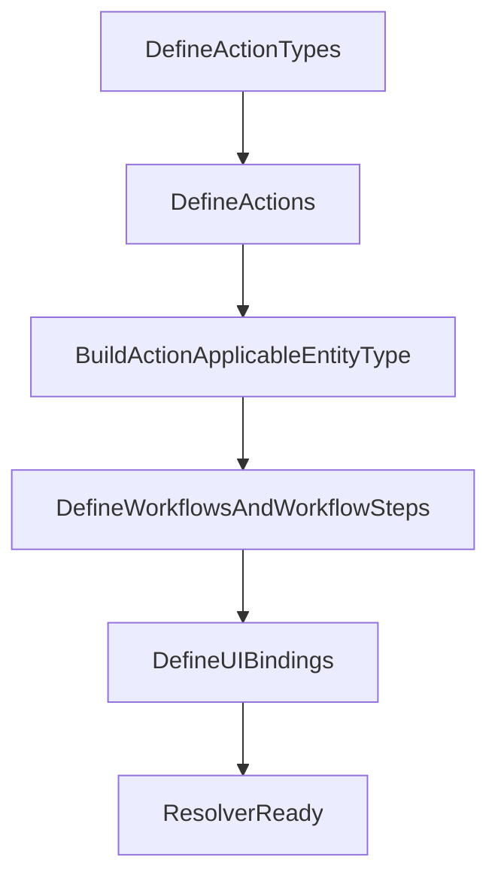
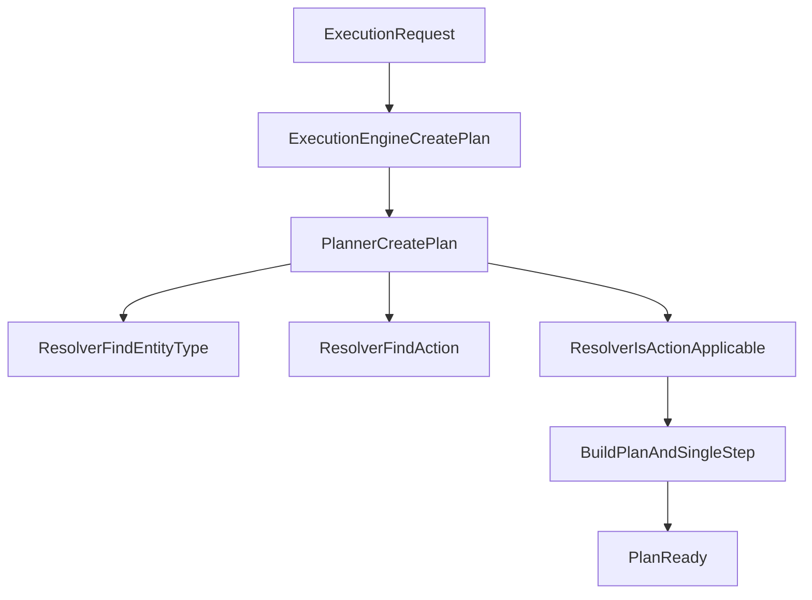
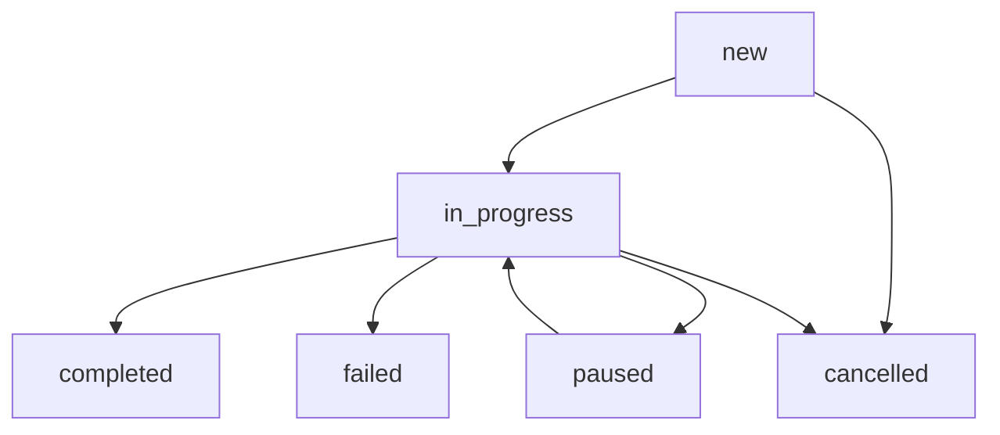

# Подробная логика работы `platform-core` с примерами

## 1. Назначение `platform-core`

`platform-core` - это доменное ядро платформы автоматизации.  
Его задача:

- описывать неизменяемые доменные модели (`Action`, `EntityType`, `Plan`, `PlanStep` и т.д.);
- валидировать базовые инварианты через конструкторы records;
- строить план выполнения пользовательского действия;
- предоставлять единый контракт `Resolver` для доступа к справочным данным;
- оставаться независимым от Spring, БД и внешнего исполнения.

Важно: `platform-core` не исполняет браузерные действия сам. Он формирует план как данные для последующего исполнения в других модулях.

---

## 2. Основные сущности ядра

### 2.1 Вход в ядро

- `ExecutionRequest`:
  - `entityType` - тип объекта (`ent-button`, `ent-input` и т.д.);
  - `entityId` - конкретный объект;
  - `action` - действие (`act-click`, `act-input-text` и т.д.);
  - `parameters` - произвольные параметры (`meta_value`, `target`).

### 2.2 Справочники

- `ActionType` - категория действия (`navigation`, `interaction`, `data_input` и т.д.).
- `Action` - атомарное действие, ссылается на `actionTypeId`.
- `EntityType` - тип объектов целевой системы.
- `Workflow` и `WorkflowStep` - жизненные циклы и шаги ЖЦ.
- `UIBinding` - связь действия с UI-селектором (нужна исполнителю).

### 2.3 Планирование

- `Plan` - корневой объект пользовательской задачи.
  - Содержит ЖЦ (`workflowId`, `workflowStepInternalName`);
  - хранит `stoppedAtPlanStepId` (точку остановки);
  - содержит список `PlanStep`.
- `PlanStep` - шаг внутри плана (мини-задача).
- `PlanStepAction` - действие внутри шага, с `metaValue`.
- `PlanResult` - агрегированный итог выполнения.
- `PlanStepLog` - детальный лог шага и ошибки.

---

## 3. Компоненты и их роли

### 3.1 `Resolver`

`Resolver` - контракт доступа к справочным данным:

- `findEntityType`, `findAction`, `findActionType`;
- `findWorkflow`, `findWorkflowStep`, `findWorkflowStepByInternalName`;
- `findActionsApplicableToEntityType`;
- `isActionApplicable`;
- `findUIBinding`.

Смысл: `Planner` не знает, где лежат данные (БД, in-memory, API). Он работает через абстракцию `Resolver`.

### 3.2 `InMemoryResolver`

`InMemoryResolver` - in-memory реализация для тестов и примеров:

- хранит сущности в `ConcurrentHashMap`;
- хранит применимость `action -> entityType` в наборе пар;
- позволяет программно регистрировать справочники (`registerEntityType`, `registerAction`, `registerWorkflow` и т.д.).

### 3.3 `Planner`

`Planner#createPlan(request)`:

1. находит `EntityType`;
2. находит `Action`;
3. проверяет применимость действия к типу объекта (`isActionApplicable`);
4. создает `Plan` с одним `PlanStep` и одним `PlanStepAction`;
5. переносит `meta_value` и `target` из `request.parameters`.

### 3.4 `ExecutionEngine`

`ExecutionEngine` - фасад над `Planner`.

- получает `ExecutionRequest`;
- делегирует построение плана в `Planner`;
- возвращает готовый `Plan`.

---

## 4. Поток 1: первичная обработка (настройка среды)

Это этап подготовки справочников до пользовательских запросов.

1. Определяются `action_type`.
2. Формируются `action`.
3. Строится граф применимости `action_applicable_entity_type`.
4. (Опционально) добавляются `workflow`, `workflow_step`, `ui_binding`.

В терминах `core` это обычно серия вызовов `register*` в `InMemoryResolver` (или сохранение в БД для `DatabaseResolver` в API-слое).



---

## 5. Поток 2: обработка пользовательского запроса

### 5.1 Целевая логика платформы

1. LLM интерпретирует запрос пользователя.
2. Находит/предлагает подходящие `entityType` и `action`.
3. Ядро строит `plan`.
4. План исполняется внешним исполнителем.
5. Формируются `plan_result` и при необходимости `plan_step_log` + `attachment`.

### 5.2 Фактическая текущая логика в этом репозитории

Сейчас `platform-core` строит одношаговый план:

- `ExecutionRequest -> ExecutionEngine#createPlan -> Planner#createPlan`;
- внутри `Planner` создается один `PlanStep` с одним `PlanStepAction`.



---

## 6. Детально: как `Planner` строит план

### Шаг 1. Проверка существования сущностей

- `resolver.findEntityType(request.entityType())`
- `resolver.findAction(request.action())`

Если не найдено - `IllegalArgumentException`.

### Шаг 2. Проверка применимости

- `resolver.isActionApplicable(action.id(), entityType.id())`

Если `false` - `IllegalArgumentException`.

### Шаг 3. Формирование структуры `Plan`

- Генерируется `planId` и `stepId` (`UUID`).
- Создается `PlanStep`:
  - `workflowId = "wf-plan-step"`
  - `workflowStepInternalName = "new"`
  - `sortOrder = 1`
  - `actions = [ new PlanStepAction(action.id(), metaValue) ]`
- Создается `Plan`:
  - `workflowId = "wf-plan"`
  - `workflowStepInternalName = "new"`
  - `stoppedAtPlanStepId = stepId`
  - `steps = [step]`

---

## 7. Развернутые примеры

### 7.1 Успешный сценарий: клик по кнопке

Подготовка:

- `entityType = ent-button`
- `action = act-click`
- зарегистрирована применимость `act-click -> ent-button`

Запрос:

```json
{
  "entityType": "ent-button",
  "entityId": "btn-1",
  "action": "act-click",
  "parameters": {}
}
```

Результат (упрощенно):

```json
{
  "workflowId": "wf-plan",
  "workflowStepInternalName": "new",
  "stoppedAtPlanStepId": "<step-uuid>",
  "steps": [
    {
      "workflowId": "wf-plan-step",
      "workflowStepInternalName": "new",
      "entityTypeId": "ent-button",
      "entityId": "btn-1",
      "sortOrder": 1,
      "actions": [
        { "actionId": "act-click", "metaValue": null }
      ]
    }
  ]
}
```

### 7.2 Успешный сценарий: передача `meta_value`

Запрос:

```json
{
  "entityType": "ent-input",
  "entityId": "input-1",
  "action": "act-input-text",
  "parameters": {
    "meta_value": "поисковый запрос"
  }
}
```

Результат:

- `PlanStepAction.metaValue == "поисковый запрос"`.

### 7.3 Ошибка: `EntityType` не найден

Если `findEntityType` не нашел `entityType`, `Planner` завершится с `IllegalArgumentException`:

`EntityType not found: <entityTypeId>`

### 7.4 Ошибка: действие не применимо к типу объекта

Если действие зарегистрировано, но пары в `action_applicable_entity_type` нет, получаем:

`Action '<actionId>' is not applicable to entity type '<entityTypeId>'`

---

## 8. Жизненный цикл плана и шага

В текущей версии ядра план создается в состоянии:

- план: `workflowId = wf-plan`, `workflowStepInternalName = new`;
- шаг: `workflowId = wf-plan-step`, `workflowStepInternalName = new`.

`stoppedAtPlanStepId` указывает на шаг, на котором находится выполнение.

Целевое состояние по BOT-1:

- добавить `WorkflowTransition`;
- валидировать переходы через `LifecycleManager`;
- поддержать обновление состояния через `PlanUpdateRequest`.



---

## 9. Что уже есть и что целевое по BOT-1

### Уже реализовано в текущем `platform-core`

- доменные records (`Action`, `EntityType`, `Workflow`, `Plan`, `PlanStep`, `PlanStepAction`, `PlanResult`, `PlanStepLog`);
- `Resolver` и `InMemoryResolver`;
- одношаговый `Planner`;
- `ExecutionEngine` как точка входа;
- тесты на успешные и ошибочные сценарии построения плана.

### Целевое расширение по BOT-1

- `WorkflowTransition`;
- `Resolver`-методы для transitions;
- `LifecycleManager`;
- `PlanValidator`;
- многошаговый `createMultiStepPlan`;
- `PlanPathFinder`;
- `PlanUpdateRequest`.

Это закрывает разрыв между текущим MVP и полной целевой логикой для работы с многошаговыми задачами и строгим ЖЦ.

---

## 10. Границы ответственности `platform-core`

`platform-core`:

- формирует и валидирует доменную модель плана;
- проверяет применимость действий к типам сущностей;
- задает контракты для резолвинга данных.

`platform-core` не делает:

- REST и JPA (это `platform-api`);
- исполнение шагов в браузере (это `platform-agent`/`platform-executor`);
- LLM-парсинг запроса (это `platform-knowledge`).

---

## 11. Практический чеклист интеграции

Перед вызовом `ExecutionEngine#createPlan` убедитесь, что:

1. зарегистрирован `EntityType`;
2. зарегистрирован `Action`;
3. зарегистрирована применимость `action -> entityType`;
4. (желательно) зарегистрированы `Workflow` и `WorkflowStep`;
5. при необходимости передан `meta_value` в `ExecutionRequest.parameters`.

После получения `Plan`:

1. сохраняем план и шаги;
2. передаем шаги в исполнитель;
3. фиксируем `PlanResult`;
4. при ошибке пишем `PlanStepLog` и attachment.

---

## 12. Источники, по которым составлен документ

Основные классы:

- `platform-core/src/main/java/com/zaborstik/platform/core/execution/ExecutionRequest.java`
- `platform-core/src/main/java/com/zaborstik/platform/core/ExecutionEngine.java`
- `platform-core/src/main/java/com/zaborstik/platform/core/planner/Planner.java`
- `platform-core/src/main/java/com/zaborstik/platform/core/resolver/Resolver.java`
- `platform-core/src/main/java/com/zaborstik/platform/core/resolver/InMemoryResolver.java`
- `platform-core/src/main/java/com/zaborstik/platform/core/plan/Plan.java`
- `platform-core/src/main/java/com/zaborstik/platform/core/plan/PlanStep.java`
- `platform-core/src/main/java/com/zaborstik/platform/core/plan/PlanStepAction.java`
- `platform-core/src/main/java/com/zaborstik/platform/core/plan/PlanResult.java`
- `platform-core/src/main/java/com/zaborstik/platform/core/plan/PlanStepLog.java`
- `platform-core/src/main/java/com/zaborstik/platform/core/domain/Action.java`
- `platform-core/src/main/java/com/zaborstik/platform/core/domain/EntityType.java`
- `platform-core/src/main/java/com/zaborstik/platform/core/domain/Workflow.java`
- `platform-core/src/main/java/com/zaborstik/platform/core/domain/WorkflowStep.java`

Тестовые сценарии:

- `platform-core/src/test/java/com/zaborstik/platform/core/planner/PlannerTest.java`
- `platform-core/src/test/java/com/zaborstik/platform/core/ExecutionEngineTest.java`
- `platform-core/src/test/java/com/zaborstik/platform/core/resolver/InMemoryResolverTest.java`
