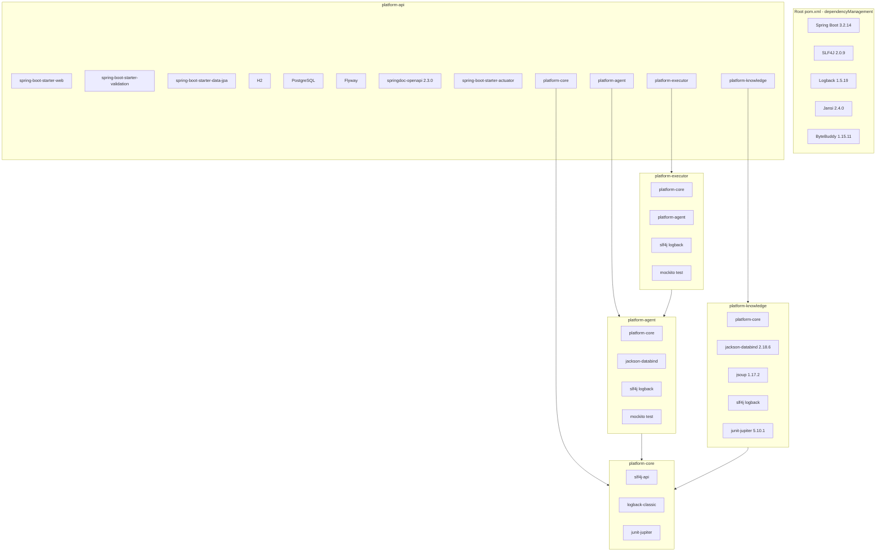
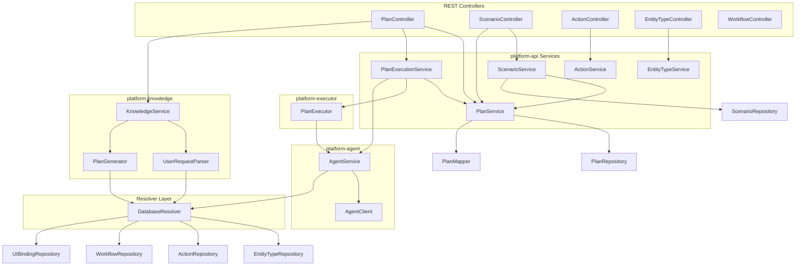

# Анализ зависимостей, уязвимостей и связей сервисов automation-platform

Документ описывает используемые библиотеки, их назначение, возможность отказа от них, известные уязвимости и граф зависимостей сервисов.

---

## 1. Граф зависимостей модулей (Maven)

---

## 2. Граф зависимостей сервисов (runtime)

**Краткое описание связей:**

| Сервис | Зависит от | Назначение связи |
|--------|------------|------------------|
| PlanController | PlanService, PlanExecutionService, KnowledgeService | Создание, выполнение планов, генерация из запроса |
| ScenarioController | ScenarioService, PlanService | Создание плана из сценария |
| PlanExecutionService | PlanService, PlanExecutor, AgentService | Оркестрация выполнения: загрузка плана, вызов executor, сохранение результата |
| PlanExecutor | AgentService | Выполнение шагов плана через UI-агента |
| AgentService | AgentClient, Resolver | Преобразование PlanStep в команды, HTTP-вызовы, разрешение селекторов (UIBinding) |
| KnowledgeService | UserRequestParser, PlanGenerator | Парсинг LLM, генерация плана из ParsedUserRequest |
| UserRequestParser | LLMClient, Resolver | Получение entity_type и action для промпта |
| PlanGenerator | Resolver | Проверка применимости действий (isActionApplicable) |
| DatabaseResolver | 6 репозиториев | Единая точка доступа к справочникам и UIBinding |

---

## 3. Java-библиотеки: назначение, возможность отказа, уязвимости

### 3.1 Spring Boot (3.2.14)

| Аспект | Описание |
|--------|----------|
| **Где используется** | platform-api (REST, JPA, validation, actuator) |
| **Зачем** | Основа приложения: встраиваемый Tomcat, авто-конфигурация, DI, управление транзакциями |
| **Можно ли отказаться** | **Нет.** Ядро проекта. Отказ потребует полной перестройки на другой фреймворк (Quarkus, Micronaut и т.п.) |
| **Уязвимости** | CVE-2024-38807, CVE-2025-22235 устранены в 3.2.14+ |

**Транзитивные зависимости (через Spring Boot BOM):**
- spring-web, spring-webmvc, spring-context, spring-core
- tomcat-embed-core
- jackson-databind, jackson-core, jackson-datatype-jsr310
- hibernate-core, spring-data-jpa
- snakeyaml, jakarta.validation-api

---

### 3.2 spring-boot-starter-web

| Аспект | Описание |
|--------|----------|
| **Где** | platform-api |
| **Зачем** | REST API, сериализация JSON, встроенный Tomcat |
| **Можно ли отказаться** | **Нет.** Основа HTTP-слоя |

---

### 3.3 spring-boot-starter-data-jpa

| Аспект | Описание |
|--------|----------|
| **Где** | platform-api |
| **Зачем** | JpaRepository, EntityManager, транзакции, ORM |
| **Можно ли отказаться** | **Нет.** Основа персистентности. Альтернатива — JDBC или R2DBC, но это крупный рефакторинг |

---

### 3.4 spring-boot-starter-validation

| Аспект | Описание |
|--------|----------|
| **Где** | platform-api (DTO: CreatePlanRequest, GeneratePlanRequest и т.д.) |
| **Зачем** | @Valid, @NotBlank, @Size и др. |
| **Можно ли отказаться** | Теоретически можно заменить ручной проверкой, но это усложнит код и снизит согласованность |

---

### 3.5 H2 (runtime)

| Аспект | Описание |
|--------|----------|
| **Где** | platform-api, профиль dev |
| **Зачем** | Локальная БД для разработки и тестов без PostgreSQL |
| **Можно ли отказаться** | Да для prod (используется PostgreSQL). Для dev — нежелательно: усложнит локальный запуск |
| **Уязвимости** | SNYK-JAVA-COMH2DATABASE-31685 — контекстно; в типичном использовании (Flyway, Spring) обычно не эксплуатируется |

---

### 3.6 PostgreSQL Driver (runtime)

| Аспект | Описание |
|--------|----------|
| **Где** | platform-api, профиль prod |
| **Зачем** | Подключение к PostgreSQL в production |
| **Можно ли отказаться** | Нет при использовании PostgreSQL. Версия берётся из Spring Boot BOM |

---

### 3.7 Flyway

| Аспект | Описание |
|--------|----------|
| **Где** | platform-api |
| **Зачем** | Миграции БД (V1–V10), идемпотентность |
| **Можно ли отказаться** | **Нет.** Критично для схемы и эволюции данных |

---

### 3.8 springdoc-openapi-starter-webmvc-ui (2.3.0)

| Аспект | Описание |
|--------|----------|
| **Где** | platform-api |
| **Зачем** | OpenAPI 3.0, Swagger UI (/swagger-ui.html, /api-docs) |
| **Можно ли отказаться** | **Да** для prod при экономии ресурсов; можно отключить через конфигурацию или исключить зависимость |
| **Уязвимости** | Нет критичных в указанной версии |

---

### 3.9 spring-boot-starter-actuator

| Аспект | Описание |
|--------|----------|
| **Где** | platform-api |
| **Зачем** | /actuator/health, кастомный AgentHealthIndicator (проверка Playwright) |
| **Можно ли отказаться** | Да, но потеряется мониторинг и health-check агента |

---

### 3.10 Jackson (jackson-databind)

| Аспект | Описание |
|--------|----------|
| **Где** | platform-api (через spring-boot), platform-agent, platform-knowledge (2.18.6 явно) |
| **Зачем** | JSON: REST, AgentCommand/AgentResponse, LLM-ответы, UIBinding metadata |
| **Можно ли отказаться** | **Нет.** Стандарт экосистемы. Альтернативы (Gson, Moshi) менее распространены в Spring |
| **Уязвимости** | GHSA-72hv-8253-57qq (async parser DoS) — исправлено в 2.18.6+ |

---

### 3.11 Jsoup (1.17.2)

| Аспект | Описание |
|--------|----------|
| **Где** | platform-knowledge (BasicAppScanner) |
| **Зачем** | Парсинг HTML: извлечение элементов (input, button, link, form, table), построение CSS-селекторов |
| **Можно ли отказаться** | Сложно. Альтернативы: HtmlUnit (тяжелее), regex (ненадёжно), встроенный parser (больше кода) |
| **Уязвимости** | Нет известных критичных в 1.17.2 |

---

### 3.12 SLF4J (2.0.9)

| Аспект | Описание |
|--------|----------|
| **Где** | Все модули |
| **Зачем** | Фасад логирования (LoggerFactory) |
| **Можно ли отказаться** | Нет без потери логирования |

---

### 3.13 Logback (1.5.19)

| Аспект | Описание |
|--------|----------|
| **Где** | Все модули |
| **Зачем** | Реализация SLF4J, конфигурация логирования |
| **Можно ли отказаться** | Нет без замены на другую реализацию (log4j2). 1.5.19 — с устранёнными CVE |

---

### 3.14 JUnit 5 (junit-jupiter)

| Аспект | Описание |
|--------|----------|
| **Где** | Все модули (test scope) |
| **Зачем** | Тесты |
| **Можно ли отказаться** | Нет для тестов |

---

### 3.15 Mockito

| Аспект | Описание |
|--------|----------|
| **Где** | platform-agent, platform-executor, platform-api (test) |
| **Зачем** | Моки в тестах |
| **Можно ли отказаться** | Можно заменить ручными заглушками, но это увеличит объём тестового кода |

---

### 3.16 Jansi (2.4.0)

| Аспект | Описание |
|--------|----------|
| **Где** | Корневой pom (dependencyManagement), транзитивно |
| **Зачем** | ANSI-цвета в консоли (Spring Boot) |
| **Можно ли отказаться** | Да, если отключить цветной вывод в консоли |

---

### 3.17 ByteBuddy (1.15.11)

| Аспект | Описание |
|--------|----------|
| **Где** | Транзитивно (Mockito, Hibernate) |
| **Зачем** | Генерация bytecode для прокси и моков |
| **Можно ли отказаться** | Только вместе с зависимостями, которые его используют |

---

## 4. Node.js зависимости (Playwright Server)

### 4.1 Playwright (^1.49.0)

| Аспект | Описание |
|--------|----------|
| **Где** | platform-agent/src/main/resources/package.json |
| **Зачем** | Автоматизация браузера (Chromium): клики, ввод, навигация, скриншоты |
| **Можно ли отказаться** | **Нет.** Ядро агента. Альтернативы: Puppeteer, Selenium — миграция потребует переработки playwright-server.js |
| **Уязвимости** | Нет известных критичных |

---

### 4.2 Express (^4.20.0)

| Аспект | Описание |
|--------|----------|
| **Где** | playwright-server.js |
| **Зачем** | HTTP-сервер для /initialize, /execute, /health, /close |
| **Можно ли отказаться** | **Да** — можно заменить на Fastify, Koa, native http. CVE-2024-43796 (XSS) устранена в 4.20.0+ |

---

## 5. Сводная таблица: можно ли отказаться от библиотек

| Библиотека | Критичность | Отказ возможен? | Комментарий |
|------------|-------------|-----------------|-------------|
| Spring Boot | Критичная | Нет | Основа приложения |
| spring-boot-starter-web | Критичная | Нет | REST API |
| spring-boot-starter-data-jpa | Критичная | Нет | Персистентность |
| spring-boot-starter-validation | Высокая | Сложно | Упрощает валидацию |
| H2 | Средняя (dev) | Для prod — да | Только dev |
| PostgreSQL | Критичная (prod) | Нет | Prod БД |
| Flyway | Критичная | Нет | Миграции |
| springdoc-openapi | Средняя | Да | Можно отключить в prod |
| spring-boot-starter-actuator | Средняя | Да | Мониторинг |
| Jackson | Критичная | Нет | JSON |
| Jsoup | Высокая (knowledge) | Сложно | Парсинг HTML |
| SLF4J / Logback | Критичная | Нет | Логирование |
| JUnit / Mockito | Высокая (test) | Нет | Тесты |
| Playwright | Критичная | Нет | Ядро агента |
| Express | Высокая | Да | Замена на Fastify и др. |

---

## 6. Известные уязвимости (актуальное состояние)

После обновлений (Spring Boot 3.2.14, Logback 1.5.19, Jackson 2.18.6, Express 4.20.0):

| Пакет | Статус | Примечание |
|-------|--------|------------|
| Spring Boot 3.2.14 | Исправлено | CVE-2024-38807, CVE-2025-22235 |
| Jackson 2.18.6 | Исправлено | GHSA-72hv-8253-57qq |
| Logback 1.5.19 | Исправлено | CVE-2024-12798, CVE-2024-12801, CVE-2025-11226 |
| Express 4.20.0 | Исправлено | CVE-2024-43796 (XSS) |
| H2 | Контекстно | SNYK-JAVA-COMH2DATABASE-31685; в типичном сценарии не критично |
| Jsoup 1.17.2 | Без известных CVE | |
| Playwright ^1.49 | Без известных CVE | |

**Рекомендация:** Регулярно запускать `mvn dependency-check:check` (OWASP plugin в корневом pom) для обнаружения новых уязвимостей.

---

## 7. Зависимости сервисов (детально)

### 7.1 PlanService

| Зависимость | Тип | Назначение |
|-------------|-----|------------|
| PlanRepository | JPA | Хранение планов |
| PlanMapper | Component | Plan ↔ PlanEntity |
| PlanResultRepository | JPA | Результаты выполнения |
| PlanStepLogEntryRepository | JPA | Логи шагов при ошибках |
| ActionRepository | JPA | Действия (для логов) |
| AttachmentRepository | JPA | Вложения (скриншоты) |
| PlanStepRepository | JPA | Шаги плана |
| WorkflowTransitionRepository | JPA | Переходы ЖЦ |

### 7.2 PlanExecutionService

| Зависимость | Тип | Назначение |
|-------------|-----|------------|
| PlanService | Service | Загрузка плана, transition, plan result, step log |
| PlanExecutor | Bean | Выполнение плана |
| AgentService | Bean | (через PlanExecutor) Выполнение шагов |

### 7.3 ScenarioService

| Зависимость | Тип | Назначение |
|-------------|-----|------------|
| ScenarioRepository | JPA | Загрузка сценария с шагами и действиями |
| PlanService | Service | Создание плана из сценария |

### 7.4 AgentService

| Зависимость | Тип | Назначение |
|-------------|-----|------------|
| AgentClient | Bean | HTTP к Playwright |
| Resolver | Bean | findUIBinding для селекторов |
| baseUrl, headless | Config | Параметры инициализации |

### 7.5 DatabaseResolver

| Зависимость | Тип | Назначение |
|-------------|-----|------------|
| EntityTypeRepository | JPA | entity_type |
| ActionTypeRepository | JPA | action_type |
| ActionRepository | JPA | action |
| WorkflowRepository | JPA | workflow |
| WorkflowStepRepository | JPA | workflow_step |
| WorkflowTransitionRepository | JPA | workflow_transition |
| UIBindingRepository | JPA | ui_binding |
| ObjectMapper | Bean | Парсинг metadata JSON |

### 7.6 KnowledgeService

| Зависимость | Тип | Назначение |
|-------------|-----|------------|
| KnowledgeRepository | Interface | Хранение AppKnowledge |
| AppScanner | Bean | Парсинг HTML |
| EntityTypeDiscovery | Bean | Маппинг UI → entity_type, action |
| UserRequestParser | Bean | LLM-парсинг запроса |
| PlanGenerator | Bean | Plan из ParsedUserRequest |

---

## 8. Циклические зависимости

В текущей архитектуре циклов нет:

- PlanController → PlanExecutionService → PlanExecutor → AgentService (линейная цепочка)
- KnowledgeService не зависит от PlanService; PlanController вызывает оба отдельно
- ScenarioService → PlanService (односторонняя связь)
- DatabaseResolver используется многими сервисами, но сам от них не зависит

---

## 9. Рекомендации по стабильности

1. **Выравнивание Jackson:** platform-knowledge явно задаёт 2.18.6. Остальные модули получают версию из Spring Boot BOM. При обновлении Spring Boot проверять совместимость Jackson.

2. **spring-data-jpa в platform-api:** Явная зависимость дублирует spring-boot-starter-data-jpa. Можно удалить, если не требуется явный контроль версии.

3. **JUnit в platform-knowledge:** Версия 5.10.1 задана явно. Лучше использовать версию из BOM или dependencyManagement родителя.

4. **OWASP Dependency Check:** Запускать регулярно (например, в CI) и реагировать на CVSS ≥ 7.

5. **Отказ от springdoc в prod:** При сборке для production можно исключить springdoc-openapi через профиль Maven, чтобы уменьшить размер артефакта и поверхность атаки.
