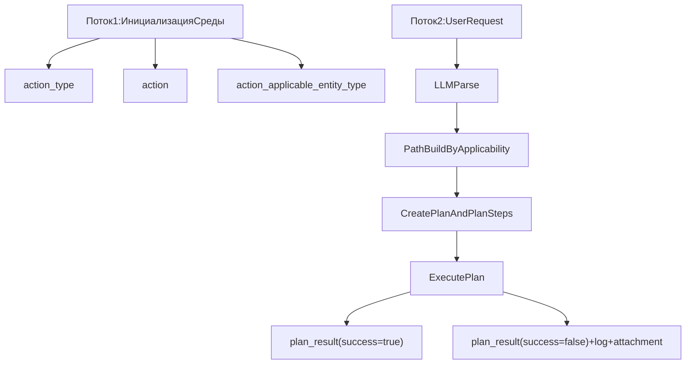
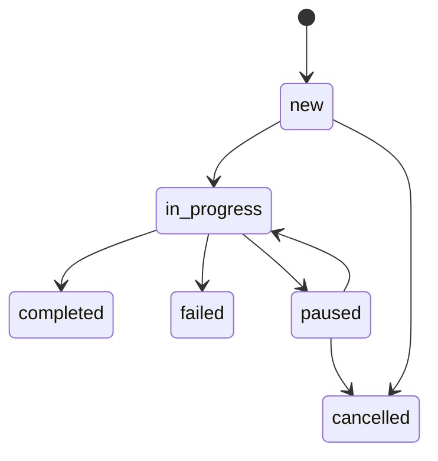
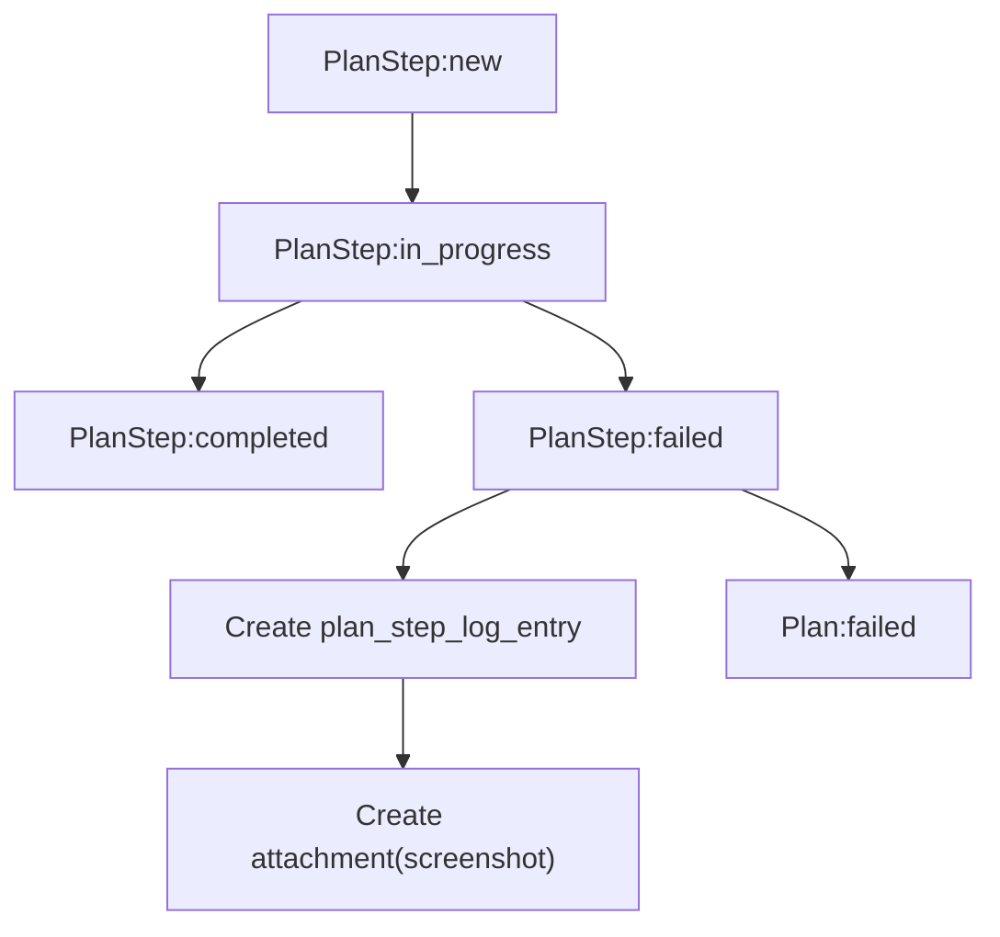

# BOT-2: Подробная логика работы `platform-api`

## 1) Контекст и цель BOT-2

`BOT-2` отвечает за слой `platform-api`: REST API, persistence-модель, доступ к данным, оркестрацию выполнения плана и фиксацию результатов.

Практически это означает:

- хранение и управление справочниками (`action_type`, `action`, `entity_type`, `workflow`, `workflow_step`);
- хранение и управление рабочими сущностями (`plan`, `plan_step`, `plan_step_action`, `plan_result`, `plan_step_log_entry`, `attachment`);
- предоставление API для создания/чтения/обновления доменных данных;
- управление жизненным циклом (ЖЦ) плана и шагов плана;
- фиксирование ошибок, артефактов и точки остановки выполнения.

---

## 2) Поток 1: первичная обработка среды (до пользовательских запросов)

Первичная обработка запускается до runtime-запросов пользователя. Ее задача - подготовить "пространство действий", чтобы затем можно было быстро строить корректные планы.

### 2.1 Шаг 1. Определение `action_type`

Создается набор типов действий верхнего уровня:

- `navigation`
- `interaction`
- `data_input`
- `validation`
- `artifact`

Это не конкретные команды, а их категории. Они используются для классификации действий и аналитики.

### 2.2 Шаг 2. Генерация `action`

На базе знаний о приложении (knowledge layer + сканирование RAD) формируется каталог конкретных действий. Например:

- `open_page`
- `click`
- `input_text`
- `select_option`
- `wait_element`
- `read_text`
- `take_screenshot`

Каждое действие хранит:

- технический идентификатор (`internalname`);
- пользовательское название (`displayname`);
- опциональные метаданные (`meta_value`);
- связь с `action_type`.

### 2.3 Шаг 3. Построение применимости `action -> entity_type`

В таблице `action_applicable_entity_type` фиксируется допустимость действия для типа объекта:

- `open_page -> page`
- `click -> button, link`
- `input_text -> input`
- `select_option -> input`
- `wait_element -> page, form`
- `read_text -> table, page`
- `take_screenshot -> page`

Это ключевой механизм, который дальше используется для построения "пути решения" в runtime.

### 2.4 Примеры для Потока 1

#### Пример A: типизация действий

Если найдено действие `click_submit_button`, оно мапится в `action_type = interaction`.

#### Пример B: генерация действия из сканирования

Сканер обнаружил элемент формы с placeholder "Введите ИНН". Создается действие `input_text` с шаблонным `meta_value`, в который позже попадет текст пользователя.

#### Пример C: ограничение по применимости

`input_text` нельзя применять к `entity_type = table`. Попытка построить шаг "ввести текст в таблицу" должна быть отвергнута еще на этапе планирования.

#### Пример D: действие-артефакт

`take_screenshot` может быть встроено как fallback-действие для `entity_type = page` в сценариях диагностики ошибок.

---

## 3) Поток 2: обработка пользовательского запроса (runtime)

### 3.1 Шаг 1. Разбор запроса через LLM

Пользователь отправляет запрос в свободной форме. LLM:

- извлекает намерение;
- выделяет целевые сущности (`entity_type`);
- выявляет параметры (например, текст для поля поиска);
- при необходимости формирует уточняющие вопросы.

### 3.2 Шаг 2. Поиск пути решения

Система сопоставляет намерение с известными действиями и таблицей применимости `action_applicable_entity_type`, после чего строит последовательность действий.

### 3.3 Шаг 3. Создание `plan`

`plan` - контейнер пользовательской задачи.

Хранит:

- текущий шаг ЖЦ (`workflow_step_internalname`);
- `stopped_at_plan_step` (на каком шаге остановились);
- цель (`target`);
- пояснение (`explanation`).

### 3.4 Шаг 4. Создание `plan_step`

`plan_step` - мини-задача внутри `plan`.

Каждый шаг хранит:

- свой ЖЦ;
- тип объекта (`entitytype`);
- конкретный объект (`entity_id`);
- порядок исполнения (`sortorder`);
- описание (`displayname`).

### 3.5 Шаг 5. Создание `plan_step_action`

У одного `plan_step` может быть несколько действий (`plan_step_action`).

Здесь хранится:

- ссылка на действие (`action`);
- параметризация (`meta_value`), например текст поискового запроса.

### 3.6 Шаг 6. Выполнение и фиксация результата

Во время выполнения:

- для каждого шага обновляется состояние;
- обновляется `stopped_at_plan_step`;
- по завершении создается `plan_result`.

При ошибке/прерывании:

- записывается `plan_step_log_entry`;
- создается `attachment` (например скриншот экрана).

### 3.7 Примеры для Потока 2

#### Пример 1: простой запрос

Запрос: "Открой страницу заказа выписки."

Результат:

- `plan` с 1 шагом;
- `plan_step_action = open_page`;
- `meta_value = https://...`.

#### Пример 2: запрос с вводом данных

Запрос: "Найди объект по кадастровому номеру 77:01:..."

Результат:

- шаг открытия страницы;
- шаг ввода номера (`input_text`, `meta_value = 77:01:...`);
- шаг запуска поиска (`click`).

#### Пример 3: запрос с валидацией

Запрос: "Проверь, что в таблице появился результат."

Результат:

- шаг ожидания (`wait_element`);
- шаг чтения (`read_text`) для `entity_type = table`.

#### Пример 4: пользователь прервал выполнение

Во время шага 3 пользователь нажал стоп:

- `plan_result.success = false`;
- в `plan_step_log_entry` фиксируется причина;
- создается `attachment` со скриншотом текущего состояния.

#### Пример 5: ошибка селектора

`click` завершился с `Element not found`:

- шаг переводится в `failed`;
- `plan` переводится в `failed`;
- сохраняется лог ошибки + screenshot.

#### Пример 6: многошаговый сценарий

Запрос: "Открой карточку, введи фильтр, экспортируй отчет."

Результат:

- 4-6 шагов плана;
- у некоторых шагов 2+ действий (например wait + click).

---

## 4) Жизненные циклы и переходы статусов

ЖЦ фиксируются через `workflow`, `workflow_step` и `workflow_transition`.

### 4.1 ЖЦ `plan`

Базовая модель переходов:

- `new -> in_progress`
- `in_progress -> completed`
- `in_progress -> failed`
- `in_progress -> paused`
- `paused -> in_progress`
- `paused -> cancelled`
- `new -> cancelled`

### 4.2 ЖЦ `plan_step`

Базовая модель переходов:

- `new -> in_progress`
- `in_progress -> completed`
- `in_progress -> failed`
- `in_progress -> paused`
- `paused -> in_progress`
- `paused -> cancelled`
- `new -> cancelled`

### 4.3 Правила исполнения ЖЦ

- в начале `executePlan()` план переводится в `in_progress`;
- перед выполнением шага шаг переводится в `in_progress`;
- при успехе шаг переводится в `completed`;
- при ошибке шаг переводится в `failed`, план - в `failed`;
- после успешного выполнения всех шагов план переводится в `completed`.

### 4.4 Роль `stopped_at_plan_step`

`stopped_at_plan_step` всегда указывает последний шаг, к которому система дошла фактически. Это важно для:

- resume/ретраев;
- диагностики;
- аналитики причин срыва сценариев.

---

## 5) Данные и связи таблиц

## 5.1 Схема `system` (справочники)

- `action_type`: типы действий;
- `action`: конкретные действия;
- `entity_type`: типы UI/доменных объектов;
- `action_applicable_entity_type`: ограничение применимости;
- `workflow`, `workflow_step`, `workflow_transition`: ЖЦ и разрешенные переходы.

## 5.2 Схема `zbrtstk` (runtime-данные)

- `plan`: задача пользователя;
- `plan_step`: шаги выполнения;
- `plan_step_action`: действия внутри шага;
- `plan_result`: итог;
- `plan_step_log_entry`: ошибки/диагностика;
- `attachment`: вложения (скриншоты и др.).

## 5.3 Ключевые связи

- `plan_step.plan -> plan.id`
- `plan_step_action.plan_step -> plan_step.id`
- `plan_step_action.action -> action.id`
- `plan_result.plan -> plan.id`
- `plan_step_log_entry.plan_step -> plan_step.id`
- `plan_step_log_entry.attachment -> attachment.id`

---

## 6) API-сценарии по шагам

## 6.1 Happy-path

1) Создать план:

```http
POST /api/plans
```

2) Проверить созданный план:

```http
GET /api/plans/{id}
```

3) Запустить выполнение:

```http
POST /api/plans/{id}/execute
```

4) Получить финальный статус через листинг:

```http
GET /api/plans?status=completed&page=0&size=20
```

## 6.2 Failure-path

1) Выполнение шага падает (например нет элемента).

2) Фиксируется:

- `plan_result` с `success=false`;
- `plan_step_log_entry` с `error`;
- `attachment` со screenshot path.

3) Клиент видит план в `failed`.

## 6.3 Lifecycle transition API

Ручной переход статуса:

```http
PATCH /api/plans/{id}/transition
{
  "targetStep": "in_progress"
}
```

Если переход недопустим - ожидается `409 Conflict`.

---

## 7) Диаграммы

### 7.1 Общая схема потоков



### 7.2 Диаграмма ЖЦ плана



### 7.3 Диаграмма выполнения шага с обработкой ошибки



---

## 8) Сквозные примеры (payload)

### 8.1 Пример: создание плана

```json
{
  "workflowId": "wf-plan",
  "workflowStepInternalName": "new",
  "target": "Найти объект по номеру",
  "explanation": "Поиск через форму и проверка таблицы",
  "steps": [
    {
      "workflowId": "wf-plan-step",
      "workflowStepInternalName": "new",
      "entityTypeId": "ent-page",
      "entityId": "search-page",
      "sortOrder": 1,
      "displayName": "Открыть страницу поиска",
      "actions": [
        {
          "actionId": "act-open-page",
          "metaValue": "https://example.local/search"
        }
      ]
    },
    {
      "workflowId": "wf-plan-step",
      "workflowStepInternalName": "new",
      "entityTypeId": "ent-input",
      "entityId": "cadastral-input",
      "sortOrder": 2,
      "displayName": "Ввести номер",
      "actions": [
        {
          "actionId": "act-input-text",
          "metaValue": "77:01:0004012:1234"
        },
        {
          "actionId": "act-click",
          "metaValue": "button.search"
        }
      ]
    }
  ]
}
```

### 8.2 Пример: успешный результат

```json
{
  "planId": "plan-1",
  "planResultId": "result-1",
  "success": true,
  "totalSteps": 2,
  "failedSteps": 0
}
```

### 8.3 Пример: ошибка и лог

```json
{
  "planId": "plan-1",
  "planStepId": "step-2",
  "planResultId": "result-1",
  "actionId": "act-click",
  "message": "Не удалось кликнуть по кнопке поиска",
  "error": "Element not found",
  "attachmentId": "att-77"
}
```

### 8.4 Пример: выборка по статусу

```http
GET /api/plans?status=failed&page=0&size=5
```

Назначение: быстрый контроль проблемных запусков.

---

## 9) Что важно для команды

- Любое новое действие должно иметь валидный `action_type` и карту применимости к `entity_type`.
- Любой runtime-сценарий должен приводить к созданию `plan_result` (успех/ошибка).
- Ошибки должны быть диагностируемы: обязательны `plan_step_log_entry` и желателен `attachment`.
- ЖЦ должен обновляться последовательно и прозрачно для клиента API.

