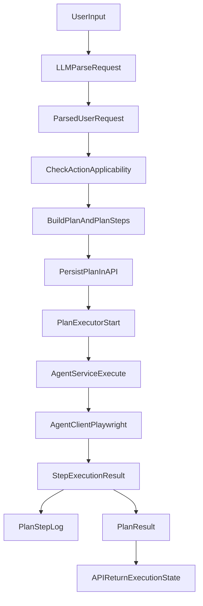
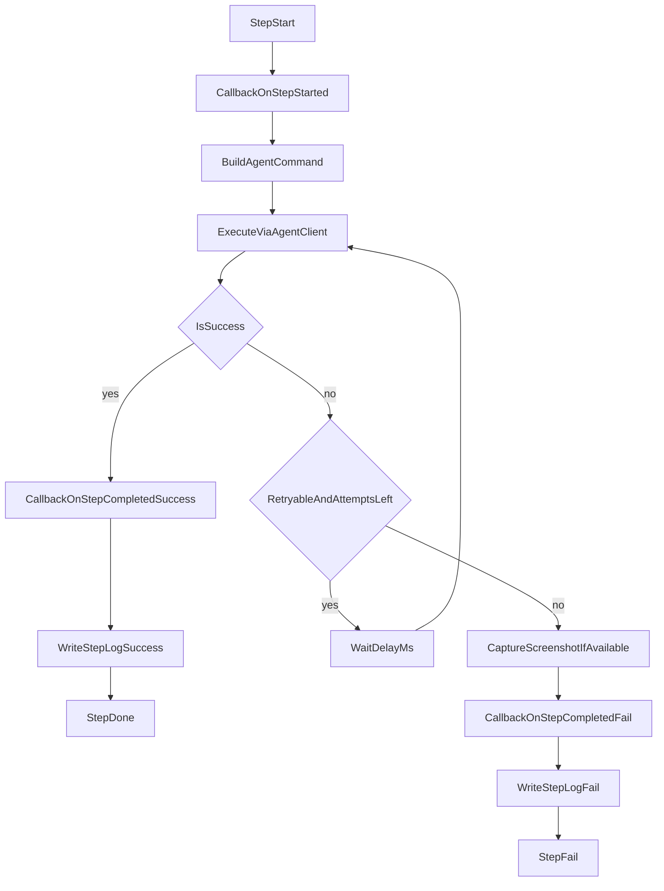

# Подробная логика работы платформы

## 1) Назначение документа

Этот документ фиксирует детальную логику работы платформы автоматизации для двух ключевых контуров:

- **первичная обработка среды** (подготовка типов действий, действий и их применимости к типам объектов);
- **обработка пользовательского запроса** (от разбора запроса LLM до исполнения плана и сохранения результата).

Документ согласован с логикой модулей `platform-knowledge`, `platform-api`, `platform-agent`, `platform-executor` и описывает целевое поведение end-to-end.

---

## 2) Терминология и роли сущностей

### Справочники и модель применимости

- `action_type` — класс действий (например: `navigation`, `interaction`, `data_input`, `validation`, `artifact`).
- `action` — конкретная операция платформы (например: `open_page`, `click`, `type`, `select_option`, `read_text`, `take_screenshot`).
- `entity_type` — тип объекта интерфейса (например: `page`, `form`, `input`, `button`, `link`, `table`).
- `action_applicable_entity_type` — таблица применимости: какие `action` допустимы для какого `entity_type`.

### Рабочие сущности исполнения

- `plan` — задача пользователя, содержащая целевой сценарий выполнения и жизненный цикл плана.
- `plan_step` — шаг плана (мини-задача), который выполняется в порядке `sortOrder`.
- `plan_step_action` — действие(я) внутри шага, включая `meta_value` (например, строка для ввода).
- `plan_result` — итог выполнения плана (успех/ошибка, временные метки).
- `plan_step_log` — журнал по шагу (сообщение, ошибка, время, ссылка на вложения).
- `attachment` — вложение (чаще всего скриншот).

---

## 3) Архитектурный обзор потока



---

## 4) Поток 1: первичная обработка среды

Цель потока — заранее сформировать «словарь возможностей» для планирования и исполнения.

### Шаг 1. Определение `action_type`

На уровне домена задаются классы действий:

- `navigation` (переходы и открытие страниц),
- `interaction` (клики, hover),
- `data_input` (ввод текста, выбор из списка),
- `validation` (чтение/проверка текста, ожидание условий),
- `artifact` (скриншоты, артефакты выполнения).

Это нужно, чтобы:

- стандартизировать действия;
- валидировать согласованность каталога;
- группировать действия для UI/админки и аналитики.

### Шаг 2. Генерация `action`

Конкретные действия формируются из:

- базы знаний о приложении (`platform-knowledge`);
- результатов сканирования UI;
- заранее заданного каталога системных действий.

Пример набора:

- `open_page`
- `click`
- `type`
- `select_option`
- `wait`
- `read_text`
- `take_screenshot`

### Шаг 3. Построение применимости `action_applicable_entity_type`

Формируется таблица соответствий:

- `type` применим к `input`;
- `select_option` применим к `input` (тип select);
- `click` применим к `button` и `link`;
- `read_text` применим к `table`/`page`;
- `take_screenshot` применим к `page`.

Эта таблица нужна как фильтр для планировщика: если действие не применимо к типу объекта, оно не должно попасть в шаг плана.

### Будущее расширение

Сегментирование по `entity_type` (и контекстам страницы/роли пользователя) позволит:

- выбирать более точные сценарии;
- сокращать число уточнений от LLM;
- уменьшать процент невалидных планов.

---

## 5) Поток 2: обработка пользовательского запроса

Ниже — целевой маршрут обработки запроса от пользователя до результата.

### Этап 1. Разбор запроса через LLM

Вход: свободный текст пользователя.  
Выход: структурированный `ParsedUserRequest`:

- целевой `entityTypeId`,
- список `actionIds`,
- `parameters` (например `meta_value`, `target`),
- флаг `clarificationNeeded`,
- `clarificationQuestion` (если нужно уточнение).

Если LLM не уверен или ответ невалиден, система возвращает уточняющий вопрос и не запускает исполнение.

### Этап 2. Поиск пути к решению

Система использует уже подготовленную применимость (`action_applicable_entity_type`):

- проверяет, что действие допустимо для выбранного типа объекта;
- отбрасывает несовместимые действия;
- строит последовательность шагов для решения задачи.

### Этап 3. Создание `plan`

Создается план с собственным ЖЦ:

- `new` -> `in_progress` -> `completed | failed | cancelled`.

План хранит:

- текущий шаг ЖЦ (`workflowStepInternalName`),
- `stoppedAtPlanStepId` (где остановилось выполнение),
- целевой контекст задачи (`target`, `explanation`).

### Этап 4. Создание `plan_step`

Формируются шаги плана:

- один план содержит несколько шагов;
- у каждого шага свой ЖЦ (`new`, `in_progress`, `completed`, `failed`, ...);
- каждый шаг содержит `entityTypeId`, `entityId`, `sortOrder`, `displayName`.

### Этап 5. Создание `plan_step_action`

Для каждого шага задается список действий:

- у шага может быть одно или несколько действий;
- `meta_value` хранит параметры выполнения (например, строку для поиска, timeout, option value).

### Этап 6. Исполнение и фиксация результата

Исполнение идет через `PlanExecutor` + `AgentService`:

- шаги переводятся в команды браузерного агента;
- фиксируется `plan_result`;
- при неуспехе/прерывании создается `plan_step_log`;
- на ошибке может сохраняться скриншот (`attachment`).

---

## 6) Жизненные циклы и обновление статусов

### ЖЦ плана (`plan`)

Базовый маршрут:

- `new` — план создан и ожидает старта;
- `in_progress` — план выполняется;
- `completed` — все обязательные шаги успешно завершены;
- `failed` — выполнение завершено ошибкой;
- `cancelled` — выполнение прервано пользователем/системой.

### ЖЦ шага (`plan_step`)

Типовой маршрут:

- `new` -> `in_progress` -> `completed` или `failed`.

### Правило `stoppedAtPlanStepId`

`plan.stoppedAtPlanStepId` обновляется на каждом переходе шага в `in_progress` и финализируется на последнем выполненном шаге:

- при успехе всего плана — на последнем завершенном шаге;
- при ошибке — на шаге, где произошел сбой;
- при `stopOnFailure=true` — на первом упавшем шаге.

---

## 7) Детализация Execution Layer

### 7.1 RetryPolicy

`RetryPolicy` задает:

- `maxRetries` — число повторов после первой попытки;
- `delayMs` — задержка между повторами;
- `retryableErrorPatterns` — шаблоны ошибок, допускающие повтор.

Принцип:

- если ошибка retryable и лимит не исчерпан — шаг повторяется;
- если ошибка не retryable — шаг завершается fail сразу;
- итоговый `StepExecutionResult` хранит `retryCount`.

### 7.2 Callback-механизм прогресса

`StepExecutionCallback` получает события:

- `onPlanStarted`,
- `onStepStarted`,
- `onStepCompleted`,
- `onPlanCompleted`.

Назначение:

- передавать прогресс в API/websocket/UI;
- строить мониторинг выполнения;
- сохранять последовательность исполнения для аудита.

### 7.3 Mapping шага в команду агента

`AgentService` конвертирует `plan_step.workflowStepInternalName` в `AgentCommand`:

- `open_page` -> `OPEN_PAGE`
- `click` -> `CLICK` / `CLICK_AT`
- `type` -> `TYPE`
- `hover` -> `HOVER`
- `wait` -> `WAIT`
- `explain` -> `EXPLAIN`
- `select_option` -> `SELECT_OPTION`
- `read_text` -> `READ_TEXT`
- `take_screenshot` -> `SCREENSHOT`

Дополнительно:

- селектор может резолвиться через `UIBinding`;
- параметры шага берутся из `plan_step_action.meta_value`.

### 7.4 stopOnFailure

Если `stopOnFailure=true`:

- при первом критическом fail дальнейшие шаги не исполняются;
- для них формируются записи «не выполнено»;
- план переводится в `failed`.

Если `stopOnFailure=false`:

- исполнитель пытается пройти оставшиеся шаги;
- общий результат плана зависит от агрегированного статуса шагов.

### 7.5 AsyncPlanExecutor

Асинхронный контур (`CompletableFuture`) позволяет:

- не блокировать API-поток;
- выполнять несколько планов параллельно;
- безопасно завершать пул (`shutdown`).

---

## 8) Последовательность исполнения шага (retry + callback + logging)



---

## 9) Pseudo-JSON модели данных

### 9.1 Пример `plan`

```json
{
  "id": "plan-8f0b1",
  "workflowId": "wf-plan",
  "workflowStepInternalName": "in_progress",
  "stoppedAtPlanStepId": "step-02",
  "target": "https://example.app/search",
  "explanation": "Найти карточку объекта по номеру",
  "steps": ["step-01", "step-02", "step-03"]
}
```

### 9.2 Пример `plan_step`

```json
{
  "id": "step-02",
  "planId": "plan-8f0b1",
  "workflowId": "wf-plan-step",
  "workflowStepInternalName": "in_progress",
  "entityTypeId": "ent-input",
  "entityId": "css:#search-input",
  "sortOrder": 1,
  "displayName": "Ввести номер объекта",
  "actions": ["act-02"]
}
```

### 9.3 Пример `plan_step_action`

```json
{
  "planStepId": "step-02",
  "actionId": "act-type",
  "metaValue": "77:01:0004011:560"
}
```

### 9.4 Пример `plan_result`

```json
{
  "planId": "plan-8f0b1",
  "success": true,
  "startedAt": "2026-03-16T12:00:00Z",
  "finishedAt": "2026-03-16T12:00:09Z",
  "totalSteps": 3,
  "failedSteps": 0
}
```

### 9.5 Пример `plan_step_log`

```json
{
  "planStepId": "step-02",
  "success": false,
  "message": null,
  "error": "Element not visible",
  "executionTimeMs": 1240,
  "retryCount": 2,
  "screenshotAttachmentId": "att-441",
  "createdAt": "2026-03-16T12:00:06Z"
}
```

---

## 10) Примеры end-to-end

## Пример 1: Happy path — «Ввести запрос в поиск и открыть карточку»

### Вход пользователя

`Открой поиск, введи номер 77:01:0004011:560 и открой карточку результата`

### Результат парсинга LLM (упрощенно)

```json
{
  "entityTypeId": "ent-input",
  "actionIds": ["act-open-page", "act-type", "act-click"],
  "parameters": {
    "searchValue": "77:01:0004011:560",
    "targetUrl": "https://example.app/search"
  },
  "clarificationNeeded": false
}
```

### Сформированный план

- `step-01` `open_page` (страница поиска);
- `step-02` `type` (ввод кадастрового номера);
- `step-03` `click` (открыть карточку из результатов).

### Выполнение

- все 3 шага завершаются успешно с `retryCount=0`;
- `plan_result.success=true`;
- `plan.workflowStepInternalName=completed`.

---

## Пример 2: Fail + retry + успех

### Вход пользователя

`Найди объект по номеру 50:12:0030401:12`

### Критичный момент

На шаге `click` первая попытка возвращает `Element not visible`.

### Поведение

- ошибка совпадает с retryable-паттерном (`not visible`);
- выполняется повтор через `delayMs`;
- вторая попытка успешна.

### Итог

- шаг завершается успехом, но с `retryCount=1`;
- план завершается `completed`;
- в логе шага отражен факт ретрая.

---

## Пример 3: Критическая ошибка + stopOnFailure

### Вход пользователя

`Открой страницу и скачай отчет`

### План

4 шага: `open_page` -> `click` -> `read_text` -> `take_screenshot`.

### Сбой

На шаге 2 возвращается ошибка `Access denied` (не retryable).

### При `stopOnFailure=true`

- шаг 2 фиксируется как `failed`;
- шаги 3 и 4 помечаются как не выполненные;
- `plan_result.success=false`;
- `plan.workflowStepInternalName=failed`;
- создается `plan_step_log` и скриншот ошибки.

---

## 11) Обработка ошибок и наблюдаемость

### Категории ошибок

- **retryable**: временные проблемы UI (`timeout`, `not found`, `not visible`);
- **non-retryable**: логические/доступные ошибки (`access denied`, `invalid state`, `unsupported command`).

### Где сохраняется наблюдаемость

- `StepExecutionResult` — тех. результат шага;
- `plan_step_log` — бизнес-журнал шага;
- `attachment` — скриншоты и артефакты;
- callback-события — канал для realtime-статусов.

### Правило для скриншотов

Скриншот сохраняется:

- по явному действию `take_screenshot`;
- при ошибках шага (если агент вернул путь к скриншоту или выполнена команда захвата экрана).

---

## 12) Практические рекомендации для интеграции API и Knowledge

- До генерации плана всегда проверять применимость `action` к `entity_type`.
- При `clarificationNeeded=true` не запускать executor, а возвращать вопрос пользователю.
- Хранить `meta_value` в стандартизированных ключах (`text`, `optionValue`, `timeoutMs`), чтобы mapping был предсказуем.
- Обновлять ЖЦ плана и шагов транзакционно в API-слое.
- Для длинных сценариев использовать `AsyncPlanExecutor` + callback-поток для UI.
- В интеграционных тестах обязательно покрывать:
  - happy-path,
  - retry-path,
  - fail-fast (`stopOnFailure=true`),
  - частичное выполнение.

---

## 13) Проверка покрытия исходной постановки (6 пунктов)

1. `action_type` определяются и используются как классификатор действий — покрыто в разделе 4.  
2. `action` формируются на базе знаний/сканирования — покрыто в разделе 4.  
3. Применимость `action` к `entity_type` задается отдельно — покрыто в разделах 4 и 5.  
4. Создание `plan` и управление его ЖЦ — покрыто в разделах 5 и 6.  
5. Создание `plan_step` и `plan_step_action` с `meta_value` — покрыто в разделах 5 и 9.  
6. После выполнения сохраняются `plan_result`, `plan_step_log`, скриншоты — покрыто в разделах 5, 9, 11.
